<div align="center">

# 🚀 @agnox/agnox-cli 

**The Future of Testing is Agnostic**

*The bridge between your local automation suites and a high-performance, AI-driven execution engine.*

[](https://github.com/keinar/agnox-cli/actions/workflows/release.yml)
[](https://www.npmjs.com/package/@agnox/agnox-cli)

</div>

---

## ⚡ Quick Start

Ship your test automation repository to the Agnox platform in seconds—no configuration required.

```bash
npx @agnox/agnox-cli@latest init
```

> No installation required. Always runs the latest cutting-edge version.

---

## ✨ The "Agnox" Vision

Agnox isn't just a CLI; it's a seamless conduit that transforms raw test projects into deployed, platform-ready artifacts. By generating intelligent, platform-agnostic Docker environments, it feeds directly into the Agnox platform's AI-powered root cause analysis via Gemini integration—turning test execution into actionable, futuristic insights.

---

## 🪄 The "Magic" (How it works)

```mermaid
graph LR
    A[💻 Local Code] -->|npx init| B(🚀 Agnox CLI)
    B -->|Buildx & Push| C[(🐳 Docker Hub)]
    C -->|Pull Image| D[🌌 Agnox Dashboard]
    D -.->|Gemini AI Analysis| A
    
    classDef default fill:#1e1e24,stroke:#8a2be2,stroke-width:2px,color:#fff;
    classDef cli fill:#4b0082,stroke:#ba55d3,stroke-width:3px,color:#fff;
    class B cli;
```



---

## 🌟 Key Features

### 🧠 **Smart Framework Detection**
Automatically detects frameworks (Playwright, Pytest) and reads your `package.json` to extract exact versions. Zero-config environments without mismatched browser binaries. Playwright versions are dynamically pinned to `mcr.microsoft.com/playwright:v{version}-jammy` to guarantee flawless execution.

### 🐍 **Advanced Python/Pytest Analysis**
For Pytest projects, the CLI automatically detects `allure-pytest` configurations, extracts required browser binaries from a `browsers.json` or requirements file, and enforces platform constraints (`linux/amd64` vs `linux/arm64`) directly tied to your python image architecture.

### 🏗️ **Modern Architecture**
Built for the future. Effortlessly supports multi-platform `buildx` execution (`linux/amd64`, `linux/arm64`), ensuring universal compatibility across any Agnox worker node anywhere in the world.

### 🤖 **AI-Ready Integration**
Test runs are captured, formatted, and shipped straight to the Agnox ecosystem where Gemini-powered, AI-driven root cause analysis turns failures into immediate, actionable solutions.

---

## 🎨 The Visual CLI Experience

We use stunning `@clack/prompts` to guide you through the process frictionlessly:

```text
│
◇  Welcome to Agnox CLI v2.0.7
│
◇  Please enter your Agnox Identity Token (found in your Dashboard settings):
│  ■■■■■■■■■■■■■■■■■■■■■
│
◇  Which testing framework does this project use?
│  ● Playwright
│  ○ Pytest
│
◇  Detected Playwright version: 1.41.0. Proceeding...
│
◇  Do you want Agnox to build and push the Docker image automatically?
│  ● Yes, handle everything
│  ○ No, just generate files
│
◇  Successfully pushed to Docker Hub!
│
└  Ready. Your identity is linked and the image is ready for the Agnox Dashboard!
```

---

## 🛤️ Workflows: Manual vs. Automatic

We support both rapid deployment and complete customization.

### 🛣️ The "Easy Path" (Build & Push via CLI)
Let Agnox handle the heavy lifting. The CLI will:
1. Generate your `Dockerfile`, `entrypoint.sh`, and `.dockerignore`.
2. Interactively authenticate via `docker login`.
3. Read the project name dynamically from `package.json`.
4. Trigger a multi-platform compilation (`linux/amd64` + `linux/arm64`) via Docker Buildx.
5. Push your pristine image directly to Docker Hub.

### 🛠️ The "Custom Path" (Manual Build)
Need custom build steps? Just choose to generate the integration files without an automated push:
1. Review and modify the generated `Dockerfile` and `entrypoint.sh`.
2. Build the image locally (`docker build . -t your-org/your-repo:tag`).
3. Push to your registry of choice.

*(Note: Never add `ENTRYPOINT` or `CMD` to your Dockerfile—the Agnox Worker injects this at runtime)*

---

## ⚙️ Development & Usage

### Prerequisites
- **Node.js 18+** — Required to execute the CLI.
- **Docker Desktop** — Must be running for the automated build & push features.

### Usage

```bash
# Run the full init + deploy flow
npx @agnox/agnox-cli@latest init

# Check installed version
npx @agnox/agnox-cli@latest --version
```

### Local Development

```bash
npm install
npm run build
node dist/index.cjs init
```

---

## 📈 Version History

- **v2.0.7**: The "Futuristic" Update. Complete rebrand to Agnox, intelligent framework detection, multi-platform buildx execution, `@clack/prompts` integration, identity collection, and native AI capabilities.
- **v1.1.x**: Initial release with base Playwright/Pytest generation.

---

## 🤝 Join the Pilot

Agnox is actively inviting forward-thinking companies to join our pilot program. Experience firsthand how our AI-driven deterministic execution engine transforms test failures into immediate bug fixes. 

**[Request a Live Demo Today](mailto:hello@agnox.io)**

---

## License

MIT
